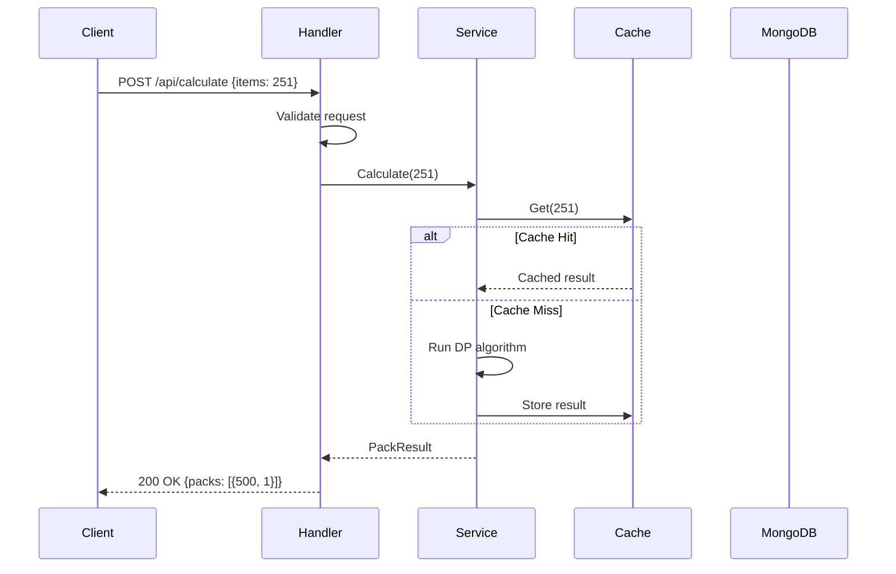
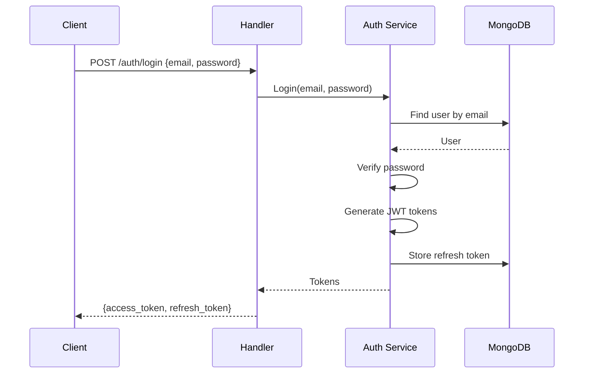
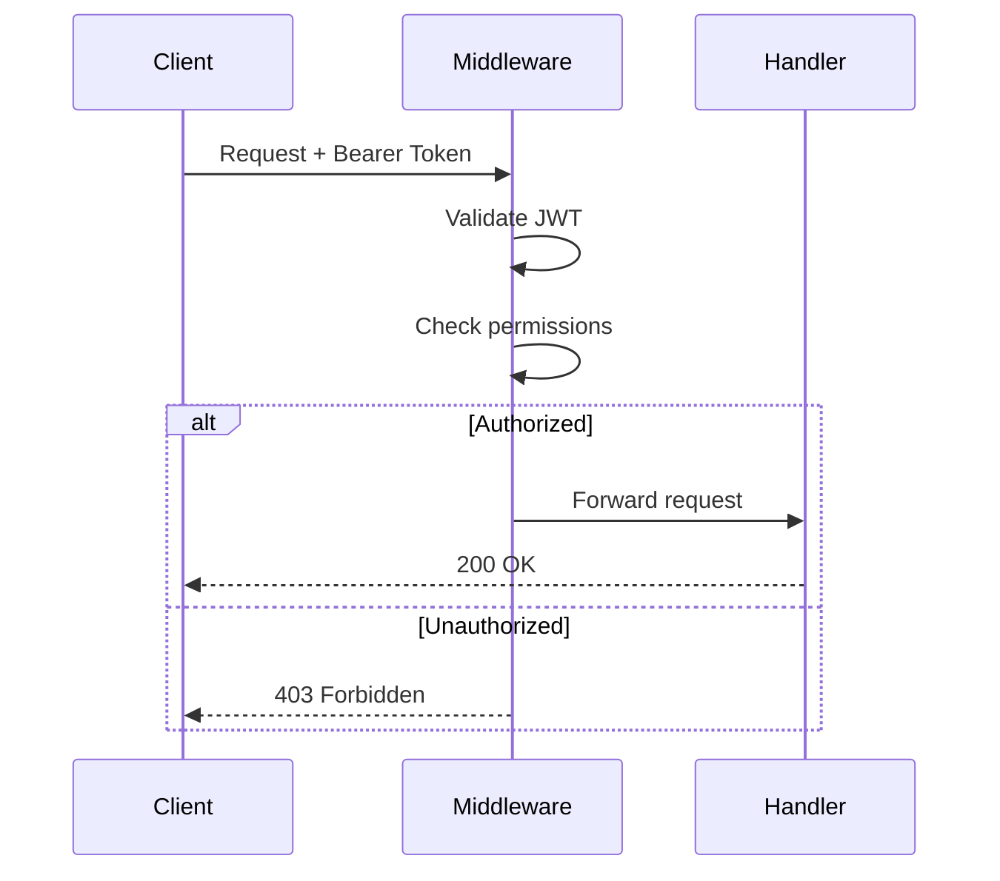
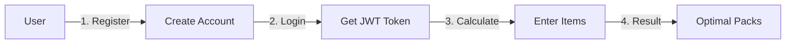

# Pack Service

A high-performance microservice for calculating optimal pack combinations to fulfill orders. Built with Go, following Clean Architecture and SOLID principles.

## Features

- **Optimal Pack Calculation** - Dynamic programming algorithm minimizing total items shipped
- **JWT Authentication** - Secure user authentication with role-based access control
- **API Key Support** - Optional API key authentication for simpler integrations
- **Caching** - LRU cache with configurable TTL and metrics
- **Idempotency** - Request deduplication via `Idempotency-Key` header
- **Rate Limiting** - Per-IP and per-user rate limiting
- **Observability** - Prometheus metrics, structured logging, request tracing
- **Health Checks** - Kubernetes-ready liveness and readiness probes
- **API Documentation** - Auto-generated Swagger/OpenAPI docs

## Tech Stack

| Component | Technology           |
|-----------|----------------------|
| Language  | Go 1.25              |
| Framework | Gin                  |
| Database  | MongoDB              |
| Auth      | JWT + API Keys       |
| Caching   | In-memory LRU        |
| Docs      | Swagger (Swaggo)     |
| CI/CD     | GitHub Actions       |
| Container | Docker (multi-stage) |

## Architecture

The service follows Clean Architecture with clear layer separation:

```
┌─────────────────────────────────────────────────────────────────────────────┐
│                                  CLIENT                                     │
└─────────────────────────────────────┬───────────────────────────────────────┘
                                      │
                                      ▼
┌─────────────────────────────────────────────────────────────────────────────┐
│                              HTTP LAYER                                     │
│  ┌─────────────┐  ┌─────────────┐  ┌─────────────┐  ┌─────────────┐         │
│  │   Router    │  │  Middleware │  │  Handlers   │  │  Response   │         │
│  │    (Gin)    │  │ Auth/Rate/  │  │             │  │   Builder   │         │
│  │             │  │   Logging   │  │             │  │             │         │
│  └─────────────┘  └─────────────┘  └─────────────┘  └─────────────┘         │
└─────────────────────────────────────┬───────────────────────────────────────┘
                                      │
                                      ▼
┌─────────────────────────────────────────────────────────────────────────────┐
│                             SERVICE LAYER                                   │
│  ┌─────────────┐  ┌─────────────┐  ┌─────────────┐  ┌─────────────┐         │
│  │    Pack     │  │    Auth     │  │    Role     │  │  Permission │         │
│  │ Calculator  │  │   Service   │  │   Service   │  │   Service   │         │
│  └─────────────┘  └─────────────┘  └─────────────┘  └─────────────┘         │
│  ┌─────────────┐  ┌─────────────┐                                           │
│  │    Cache    │  │   Logging   │                                           │
│  │  (Sharded)  │  │   Service   │                                           │
│  └─────────────┘  └─────────────┘                                           │
└─────────────────────────────────────┬───────────────────────────────────────┘
                                      │
                                      ▼
┌─────────────────────────────────────────────────────────────────────────────┐
│                            REPOSITORY LAYER                                 │
│  ┌─────────────┐  ┌─────────────┐  ┌─────────────┐  ┌─────────────┐         │
│  │    User     │  │    Role     │  │ Permission  │  │    Token    │         │
│  │    Repo     │  │    Repo     │  │    Repo     │  │    Repo     │         │
│  └─────────────┘  └─────────────┘  └─────────────┘  └─────────────┘         │
└─────────────────────────────────────┬───────────────────────────────────────┘
                                      │
                                      ▼
┌─────────────────────────────────────────────────────────────────────────────┐
│                                DATABASE LAYER                               │
│                      ┌───────────────────────────┐                          │
│                      │         MongoDB           │                          │
│                      │    (Connection Pool)      │                          │
│                      └───────────────────────────┘                          │
└─────────────────────────────────────────────────────────────────────────────┘
```

### Pack Calculation Flow



### Authentication Flow



### Authorization Flow



## Getting Started Guide

This guide walks you through running the application and using it with the frontend.

### Business Flow Overview



**The typical user journey:**

1. **Register** - Create an account on the frontend (email + password)
2. **Login** - Authenticate to receive JWT access and refresh tokens
3. **Calculate** - Enter the number of items you want to order
4. **Result** - Get the optimal pack combination that minimizes waste

### Running the Application

#### Option 1: Docker Compose (Recommended for Development)

The easiest way to run everything with MongoDB included.

```bash
# 1. Clone and enter the project
git clone https://github.com/guttosm/pack-service.git
cd pack-service

# 2. Create your environment file
cp .env.example .env

# 3. Generate secure keys for JWT (optional but recommended)
go run scripts/generate_keys.go
# Copy the generated keys to your .env file

# 4. Start all services
docker compose up -d

# 5. Check if everything is running
docker compose ps

# 6. View logs
docker compose logs -f pack-service
```

**Services started:**
- **Pack Service API**: http://localhost:8080
- **Swagger UI**: http://localhost:8080/swagger/index.html
- **MongoDB**: localhost:27017

```bash
# Stop services
docker compose down

# Stop and remove all data (clean reset)
docker compose down -v
```

#### Option 2: Run with Go (Development)

Best for active development with hot reload capabilities.

```bash
# 1. Install Go 1.25+ from https://go.dev/dl/

# 2. Clone the repository
git clone https://github.com/guttosm/pack-service.git
cd pack-service

# 3. Install dependencies
go mod download

# 4. Start MongoDB (using Docker)
docker run -d --name mongodb -p 27017:27017 mongo:7

# 5. Create environment file
cp .env.example .env

# 6. Run the application
go run ./cmd/main.go
```

**Or build and run a binary:**

```bash
# Build optimized binary
go build -ldflags="-w -s" -o pack-service ./cmd/main.go

# Run the binary
./pack-service
```

#### Option 3: Build Docker Image

Build your own Docker image for deployment.

```bash
# Build the image
docker build -t pack-service:1.0.0 .

# Run with environment variables
docker run -d \
  --name pack-service \
  -p 8080:8080 \
  -e MONGODB_ENABLED=false \
  -e AUTH_ENABLED=false \
  -e PACK_SIZES=250,500,1000,2000,5000 \
  pack-service:1.0.0

# Run with external MongoDB
docker run -d \
  --name pack-service \
  -p 8080:8080 \
  -e MONGODB_URI=mongodb://your-host:27017/pack_service \
  -e MONGODB_ENABLED=true \
  -e AUTH_ENABLED=true \
  -e JWT_SECRET_KEY=your-secret-key \
  -e JWT_REFRESH_SECRET_KEY=your-refresh-key \
  pack-service:1.0.0

# View logs
docker logs -f pack-service

# Stop and remove
docker stop pack-service && docker rm pack-service
```

### Using the Application

#### Step 1: Verify the API is Running

```bash
curl http://localhost:8080/healthz
```

Expected response:
```json
{"status": "ok"}
```

#### Step 2: Register a New User

```bash
curl -X POST http://localhost:8080/api/auth/register \
  -H "Content-Type: application/json" \
  -d '{
    "email": "user@example.com",
    "password": "SecurePassword123!",
    "name": "John Doe"
  }'
```

Response:
```json
{
  "data": {
    "id": "507f1f77bcf86cd799439011",
    "email": "user@example.com",
    "name": "John Doe"
  },
  "message": "User registered successfully"
}
```

#### Step 3: Login to Get Tokens

```bash
curl -X POST http://localhost:8080/api/auth/login \
  -H "Content-Type: application/json" \
  -d '{
    "email": "user@example.com",
    "password": "SecurePassword123!"
  }'
```

Response:
```json
{
  "data": {
    "access_token": "eyJhbGciOiJIUzI1NiIsInR5cCI6IkpXVCJ9...",
    "refresh_token": "eyJhbGciOiJIUzI1NiIsInR5cCI6IkpXVCJ9...",
    "expires_in": 900
  }
}
```

**Save the `access_token`** - you'll need it for authenticated requests.

#### Step 4: Calculate Optimal Packs

**Without authentication** (if `AUTH_ENABLED=false`):

```bash
curl -X POST http://localhost:8080/api/calculate \
  -H "Content-Type: application/json" \
  -d '{"items_ordered": 251}'
```

**With authentication** (if `AUTH_ENABLED=true`):

```bash
curl -X POST http://localhost:8080/api/calculate \
  -H "Content-Type: application/json" \
  -H "Authorization: Bearer YOUR_ACCESS_TOKEN" \
  -d '{"items_ordered": 251}'
```

Response:
```json
{
  "data": {
    "ordered_items": 251,
    "total_items": 500,
    "packs": [
      {"size": 500, "quantity": 1}
    ]
  },
  "request_id": "550e8400-e29b-41d4-a716-446655440000"
}
```

#### Step 5: Try Different Numbers

| Items Ordered | Optimal Packs | Total Items | Waste |
|---------------|---------------|-------------|-------|
| 1 | 1 × 250 | 250 | 249 |
| 250 | 1 × 250 | 250 | 0 |
| 251 | 1 × 500 | 500 | 249 |
| 501 | 1 × 500 + 1 × 250 | 750 | 249 |
| 12001 | 2 × 5000 + 1 × 2000 + 1 × 250 | 12250 | 249 |

```bash
# Try these examples
curl -X POST http://localhost:8080/api/calculate -H "Content-Type: application/json" -d '{"items_ordered": 1}'
curl -X POST http://localhost:8080/api/calculate -H "Content-Type: application/json" -d '{"items_ordered": 501}'
curl -X POST http://localhost:8080/api/calculate -H "Content-Type: application/json" -d '{"items_ordered": 12001}'
```

#### Step 6: Refresh Your Token (Before Expiry)

```bash
curl -X POST http://localhost:8080/api/auth/refresh \
  -H "Content-Type: application/json" \
  -d '{"refresh_token": "YOUR_REFRESH_TOKEN"}'
```

#### Step 7: Logout

```bash
curl -X POST http://localhost:8080/api/auth/logout \
  -H "Authorization: Bearer YOUR_ACCESS_TOKEN"
```

### Frontend Integration

The Pack Service is designed to work with a frontend application. Here's how they connect:

```
┌─────────────────┐         ┌─────────────────┐         ┌─────────────────┐
│    Frontend     │  HTTP   │   Pack Service  │  TCP    │    MongoDB      │
│  (React/Vue)    │◄───────►│   (This API)    │◄───────►│   (Database)    │
│  localhost:3000 │         │  localhost:8080 │         │  localhost:27017│
└─────────────────┘         └─────────────────┘         └─────────────────┘
```

**Frontend stores:**
- `access_token` in memory (for API calls)
- `refresh_token` in httpOnly cookie or secure storage

**CORS Configuration:**

By default, the API allows requests from `localhost:3000`. For production, set:

```bash
# In .env or environment
CORS_ORIGINS=https://your-frontend-domain.com
```

---

## API Documentation

### Swagger UI

Access interactive API documentation at:
```
http://localhost:8080/swagger/index.html
```

Regenerate documentation:
```bash
make swagger
```

### Endpoints Overview

#### Infrastructure

| Method | Path         | Description        |
|--------|--------------|--------------------|
| GET    | `/healthz`   | Liveness probe     |
| GET    | `/readyz`    | Readiness probe    |
| GET    | `/metrics`   | Prometheus metrics |
| GET    | `/swagger/*` | API documentation  |

#### Authentication

| Method | Path                 | Description       | Auth |
|--------|----------------------|-------------------|------|
| POST   | `/api/auth/login`    | User login        | No   |
| POST   | `/api/auth/register` | User registration | No   |
| POST   | `/api/auth/refresh`  | Refresh token     | No   |
| POST   | `/api/auth/logout`   | User logout       | JWT  |

#### Pack Operations

| Method | Path                      | Description             | Auth     |
|--------|---------------------------|-------------------------|----------|
| POST   | `/api/calculate`          | Calculate optimal packs | Optional |
| GET    | `/api/pack-sizes`         | Get active pack sizes   | Optional |
| PUT    | `/api/pack-sizes`         | Update pack sizes       | Optional |
| GET    | `/api/pack-sizes/history` | Pack sizes history      | Optional |

### Example Request

```bash
curl -X POST http://localhost:8080/api/calculate \
  -H "Content-Type: application/json" \
  -d '{"items_ordered": 251}'
```

**Response:**
```json
{
  "data": {
    "ordered_items": 251,
    "total_items": 500,
    "packs": [{"size": 500, "quantity": 1}]
  },
  "request_id": "550e8400-e29b-41d4-a716-446655440000"
}
```

## Configuration

### Environment Variables

| Variable                 | Description                      | Default                     |
|--------------------------|----------------------------------|-----------------------------|
| `PORT`                   | HTTP server port                 | `8080`                      |
| `MONGODB_URI`            | MongoDB connection string        | `mongodb://localhost:27017` |
| `MONGODB_DATABASE`       | Database name                    | `pack_service`              |
| `AUTH_ENABLED`           | Enable authentication            | `false`                     |
| `API_KEYS`               | Valid API keys (comma-separated) | -                           |
| `JWT_SECRET_KEY`         | JWT signing key                  | -                           |
| `JWT_REFRESH_SECRET_KEY` | JWT refresh token key            | -                           |
| `JWT_ACCESS_TOKEN_TTL`   | Access token TTL                 | `15m`                       |
| `JWT_REFRESH_TOKEN_TTL`  | Refresh token TTL                | `168h`                      |
| `RATE_LIMIT`             | Requests per window              | `100`                       |
| `RATE_WINDOW`            | Rate limit window                | `1m`                        |
| `CACHE_SIZE`             | Cache capacity                   | `1000`                      |
| `CACHE_TTL`              | Cache TTL                        | `5m`                        |
| `PACK_SIZES`             | Custom pack sizes                | `250,500,1000,2000,5000`    |

## Development

### Common Commands

```bash
make build          # Build binary
make run            # Run locally
make test           # Run all tests
make test-unit      # Run unit tests only
make test-integration  # Run integration tests
make coverage       # Generate coverage report
make lint           # Run linter
make fmt            # Format code
make swagger        # Generate API docs
make mocks          # Generate test mocks
make docker-up      # Start with Docker Compose
make docker-down    # Stop containers
```

### Project Structure

```
pack-service/
├── cmd/main.go              # Application entry point
├── config/                  # Configuration management
├── docs/                    # Generated Swagger docs
├── internal/
│   ├── app/                 # Application initialization
│   ├── circuitbreaker/      # Circuit breaker pattern
│   ├── domain/
│   │   ├── dto/             # Request/Response DTOs
│   │   └── model/           # Domain models
│   ├── http/                # HTTP handlers & routing
│   ├── i18n/                # Internationalization
│   ├── logger/              # Structured logging
│   ├── metrics/             # Prometheus metrics
│   ├── middleware/          # HTTP middleware
│   ├── mocks/               # Generated mocks
│   ├── repository/          # Data access layer
│   ├── service/             # Business logic
│   │   └── cache/           # Cache implementations
│   └── testutil/            # Test utilities
├── .github/workflows/       # CI/CD pipelines
├── Dockerfile               # Multi-stage build
├── docker-compose.yml       # Local development
└── Makefile                 # Build automation
```

## Testing

```bash
# Run all tests
make test

# Run with coverage
make coverage-html

# Run benchmarks
make bench
```

**Coverage Target:** 85%

## Security

- Non-root Docker user
- JWT with refresh tokens
- Role-based access control
- Rate limiting (IP and user-based)
- Input validation
- Security scanning in CI (Trivy)
- Circuit breaker for database resilience

## License

MIT
